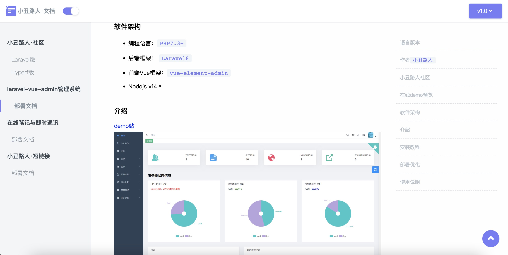

# laravel-my-documents

#### 介绍
基于`binarytorch/larecipe`扩展包的文档项目
- https://larecipe.saleem.dev/docs/2.2/installation

#### 软件架构
- Laravel:8.75
- PHP:7.3^8.0

#### 安装教程

1.  composer install
2.  cp .env.example .env
3.  生成 APP_KEY：`php artisan key:generate`
4.  php artisan larecipe:install

#### [小丑路人·文档](https://docs.cnpscy.com)

